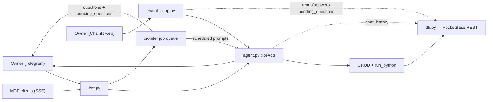

# Telegram Data-Collection Bot (LLM-powered)

[](https://www.python.org/)
[](https://github.com/python-telegram-bot/python-telegram-bot)
[](https://www.langchain.com/)
[](https://langchain-ai.github.io/langgraph/)
[](https://pocketbase.io/)
[](https://www.docker.com/)
[](LICENSE)

A Telegram bot that regularly collects data from its owner, returns statistics,
and can manage its own configuration through a LangChain agent. The "quiz"
naming is misleading: there is no right/wrong — it just records data.

Data is stored in **PocketBase** (three collections). On first boot the bot
auto-creates missing collections and can seed questions from `questions.json`.

## Architecture



`bot.py` stays the sole owner of cron scheduling and answer timeouts.
`chainlit_app.py` is a second, independent process that reads/writes the same
PocketBase collections — it does not run its own scheduler.

## Components
- **Questions** (`questions`): each has its own cron and timeout. If no answer
  arrives in time, the prompt message is deleted.
- **Answers** (`answers`): stored in PocketBase.
- **Scheduled prompts** (`scheduled_prompts`): cron-driven LLM **instructions**
  whose output is sent back to the owner. The `prompt` column must be an
  imperative task for the agent (e.g. "Summarize the last 7 days of mood data"),
  not a chat question. Typically used for recurring reports.
- **LLM agent**: replies to the owner's free-form messages, performs CRUD
  through tools, runs Python analytics, and manages scheduled prompts.
- **Pending questions** (`pending_questions`): tracks which question is
  currently awaiting an answer (and its expiry), shared between Telegram and
  Chainlit so both show the same outstanding question and stop asking once
  either channel answers it.
- **Chat history** (`chat_history`): the LLM conversation history, shared
  between Telegram and Chainlit so either channel can continue the same
  conversation.

## Question types
- `scale` → numeric scale (e.g. 1-5 buttons)
- `rating` → labeled scale with options
- `choice` → multiple choice
- `open` → open-ended (reply to the bot's message to answer)

## 1) Create the bot
1. Open **@BotFather** in Telegram → `/newbot` → get the token.
2. Set up a PocketBase instance (self-hosted or existing) and create admin
   credentials.
3. Copy `.env.example` to `.env`, fill `BOT_TOKEN`, `PB_URL`, `PB_EMAIL`,
   and `PB_PASSWORD`.
4. Leave `CHAT_ID` empty for now.
5. Run the bot, send `/start` to it from your own account → it will reply with
   your chat id.
6. Put that id into `.env` as `CHAT_ID`, add the LLM provider + key, then
   **restart** the bot.

While `CHAT_ID` is empty the bot only echoes the caller's chat id and does
nothing else — the LLM and the scheduler stay disabled. This keeps the bot
inert until you have finished setup.

## 2) Local run
```bash
python -m venv venv && source venv/bin/activate
pip install -r requirements.txt
export $(grep -v '^#' .env | xargs)
python bot.py
```

## 3) Docker
```bash
docker compose up -d --build
```
The container runs as a non-root user. Data lives in PocketBase (configured via
`PB_*` env vars), not inside the container.

On first boot, if the `questions` collection is empty, `questions.json` is
loaded as a seed. After that, PocketBase is the canonical source.

## 4) LLM agent
Any plain-text message from the owner triggers the agent. Tools:

| Tool | Purpose |
|---|---|
| `list_questions` / `get_question` | read |
| `add_question` / `update_question` / `delete_question` | question CRUD |
| `query_answers` / `delete_answer` | filter and remove answers |
| `list_scheduled_prompts` / `add_scheduled_prompt` / `update_scheduled_prompt` / `delete_scheduled_prompt` | scheduled prompt CRUD |
| `run_python` | Python execution for analytics, charts (`plt`), and tables (`send_table`; `pd`, `db` available) |
| `now` | current date-time in the bot's timezone |

`query_answers` supports day-level filters (`since_day` / `until_day`) and
timestamp-level filters (`since_ts` / `until_ts`, ISO 8601).

When CRUD tools change the DB the scheduler auto-resyncs (no restart needed).

Chat memory: keeps the last 20 turns, shared between Telegram and Chainlit
(stored in the `chat_history` collection), and resets if more than 1 hour has
passed since the previous message. Use `/clear` (Telegram) to reset it
immediately — this also clears it for Chainlit, since it's the same history.
MCP sessions use the same limit/reset rules but keep their own per-connection
history, separate from Telegram/Chainlit.

### LLM providers
`LLM_PROVIDER` env: `openai` (default) | `anthropic` | `ollama`.
Provider key env: `OPENAI_API_KEY` / `ANTHROPIC_API_KEY` / `OLLAMA_BASE_URL`.
Override the model with `LLM_MODEL`.

Default models per provider:
- `openai` → `gpt-4o-mini`
- `anthropic` → `claude-haiku-4-5-20251001`
- `ollama` → `llama3.1`

#### gpt-luna models
Any `openai`-provider model whose name contains `luna` (e.g. `gpt-5.6-luna`)
is served by a gateway that injects a `reasoning_effort` default.
`/v1/chat/completions` rejects that default as soon as function tools are
attached, and the agent always attaches tools:

> Function tools with reasoning_effort are not supported for gpt-5.6-luna in
> /v1/chat/completions. To use function tools, use /v1/responses or set
> reasoning_effort to none.

`agent.openai_model_overrides` therefore sends `reasoning_effort="none"`
explicitly for these models, which overrides the injected default. It also
pins `temperature` to `1`, the only value reasoning models accept — the
default `0.7` that `langchain-openai` always puts on the wire cannot be
omitted in the pinned version. No other model or provider is affected.

Covered by `tests/test_llm_params.py`, which asserts the request body on a
mocked transport. Run it with:

```bash
python -m unittest discover -s tests
```

## 5) Commands
- `/start` — command help as a table image (chat id in caption)
- `/list` — table image of active questions + scheduled prompts (next cron run)
- `/ask [qid]` — trigger manually (no qid → all)
- `/stats` — summary table image plus a scale-trend chart when applicable
- `/dump` — download the full database as `db_dump.json`
- `/clear` — reset Telegram LLM chat history (next message starts a fresh session)

All commands respond only to the configured `CHAT_ID`; other senders are
ignored silently.

## 6) Configuration

| Env var | Default | Notes |
|---|---|---|
| `BOT_TOKEN` | — | required |
| `CHAT_ID` | empty | owner-only filter; empty = id-only mode |
| `TIMEZONE` | `Europe/Istanbul` | IANA tz used for cron + display |
| `PB_URL` | — | PocketBase base URL (e.g. `https://pb.example.com`) |
| `PB_EMAIL` | — | PocketBase admin email |
| `PB_PASSWORD` | — | PocketBase admin password |
| `LLM_PROVIDER` | `openai` | `openai` / `anthropic` / `ollama` |
| `LLM_MODEL` | provider default | override |
| `OPENAI_API_KEY` | — | required when provider = openai |
| `ANTHROPIC_API_KEY` | — | required when provider = anthropic |
| `OLLAMA_BASE_URL` | — | e.g. `http://localhost:11434` |
| `MCP_HOST` | `127.0.0.1` | bind host for the MCP SSE server |
| `MCP_PORT` | `8765` | bind port for the MCP SSE server |
| `MCP_TOKEN` | empty | Bearer token; empty disables the MCP server |
| `CHAINLIT_AUTH_SECRET` | empty | JWT signing secret for the Chainlit session cookie; required to run `chainlit_app.py` (`chainlit create-secret`) |
| `CHAINLIT_AUTH_USERNAME` | empty | login for the Chainlit web chat; required to run `chainlit_app.py` |
| `CHAINLIT_AUTH_PASSWORD` | empty | password for the Chainlit web chat; required to run `chainlit_app.py` |

## 7) MCP (SSE) server
When `MCP_TOKEN` is set, the bot also exposes its agent as an MCP server over
SSE so other agents (Claude Code, IDE clients, …) can call it.

- Endpoint: `http://$MCP_HOST:$MCP_PORT/sse`
- Auth: `Authorization: Bearer $MCP_TOKEN` on every request
- Tool: `ask_agent(prompt: str)` — runs the same ReAct agent the Telegram
  bot uses. Returns text plus matplotlib charts and Plotly table images as
  image content.
- History: each SSE connection is its own session with its own history,
  separate from the Telegram chat history. The same turn/gap limits are applied.
- Concurrency: Telegram, scheduled prompts, and MCP calls share one agent
  instance; agent invocations are serialized with an async lock to avoid
  overlapping tool/PocketBase execution.

Example client config (Claude Code):
```json
{
  "mcpServers": {
    "quizbot": {
      "transport": "sse",
      "url": "http://127.0.0.1:8765/sse",
      "headers": { "Authorization": "Bearer YOUR_MCP_TOKEN" }
    }
  }
}
```

## 8) Schema (PocketBase collections)
The bot auto-creates these collections on startup if they do not exist.

### `questions`
| Field | Type | Notes |
|---|---|---|
| `slug` | text | human-readable id (exposed as `id` in the API) |
| `type` | text | `scale` / `rating` / `choice` / `open` |
| `text` | text | prompt shown to the owner |
| `config` | json | type-specific options |
| `cron` | text | 5-field cron expression |
| `timeout_minutes` | number | unanswered prompt deletion delay |
| `active` | bool | whether the question is scheduled |

`config` examples:
- `scale`: `{"min":1,"max":5,"labels":{"1":"...","5":"..."}}`
- `rating`/`choice`: `{"options":["a","b","c"]}`
- `open`: `{}`

### `answers`
| Field | Type | Notes |
|---|---|---|
| `id` | auto | PocketBase record id (15-char string) |
| `ts` | text | ISO 8601 timestamp |
| `day` | text | `YYYY-MM-DD` |
| `qid` | text | question slug |
| `qtype` | text | question type at answer time |
| `answer` | text | stored value |

### `scheduled_prompts`
| Field | Type | Notes |
|---|---|---|
| `slug` | text | human-readable id (exposed as `id` in the API) |
| `prompt` | text | imperative LLM instruction |
| `cron` | text | 5-field cron expression |
| `active` | bool | whether the prompt is scheduled |

### `pending_questions`
| Field | Type | Notes |
|---|---|---|
| `qid` | text | question slug |
| `asked_at` | text | ISO 8601 timestamp |
| `expires_at` | text | ISO 8601 timestamp; matches the question's `timeout_minutes` |
| `status` | text | `pending` / `answered` / `expired` |

### `chat_history`
| Field | Type | Notes |
|---|---|---|
| `ts` | text | ISO 8601 timestamp |
| `role` | text | `user` / `assistant` |
| `content` | text | message content |

PocketBase v0.23+ requires record ids to be at least 15 characters, so
`questions` and `scheduled_prompts` use a `slug` field for short human-readable
ids. All bot/agent APIs still refer to these as `id`.

If you mutate PocketBase directly (admin UI or REST), restart the bot so the
scheduler picks up the change (agent tools auto-resync; manual edits do not).

## 9) Backup
- **Quick export:** `/dump` in Telegram → `db_dump.json` with all collections.
- **PocketBase:** use the built-in backup/export features of your PocketBase
  instance, or schedule periodic dumps via the PocketBase API.

## 10) Chainlit web chat
`chainlit_app.py` is an alternative, password-protected web chat for the same
owner — no Telegram account needed to use it. It shares the same LLM agent,
chat history, and pending questions with the Telegram bot; only cron
scheduling and answer timeouts stay in `bot.py`.

Setup: put `CHAINLIT_AUTH_SECRET` (from `chainlit create-secret`),
`CHAINLIT_AUTH_USERNAME` and `CHAINLIT_AUTH_PASSWORD` in `.env`, then:
```bash
chainlit run chainlit_app.py --host 0.0.0.0 --port 8000
```
Or via `docker compose up -d --build` (starts alongside the Telegram bot,
exposed on port 8000). `chainlit_app.py` refuses to start if any of the three
is missing.

Behavior:
- On opening the page, any currently pending question (asked by `bot.py`'s
  scheduler, not yet answered or expired) is offered. Answering it here marks
  it answered in `pending_questions`, so Telegram won't prompt for it again,
  and vice versa — whichever channel answers first wins, the other declines.
- Chainlit holds a single "ask" slot per session, so button questions
  (`scale` / `rating` / `choice`) are shown **one at a time**; the next appears
  once the current one is answered or its on-screen window lapses. `open`
  questions are queued and prompted one by one after those, since they are
  answered as ordinary chat messages.
- Buttons stay on screen for at most 5 minutes even when the question's
  `timeout_minutes` is longer — an outstanding ask disables the chat input.
  The question itself stays pending in PocketBase until answered or expired,
  so reloading the page offers it again.
- Any other message goes to the same LLM agent as Telegram, with the same
  shared chat history.

Known limitation: if the LLM agent adds/edits a question's cron via a
Chainlit message, `bot.py`'s running scheduler does not pick up the change
immediately — it does so only after its own reschedule trigger (e.g. the next
scheduled fire, or an edit made from Telegram) or a restart.

## Notes
- Open questions must be answered as a **reply** to the bot's prompt
  (ForceReply is set automatically). Plain text without a reply goes to the
  LLM agent.
- Cron jobs missed while the bot was offline are not back-filled.
- The `run_python` tool executes arbitrary Python code and is not sandboxed.
  Keep the bot owner-only and do not expose MCP publicly.
